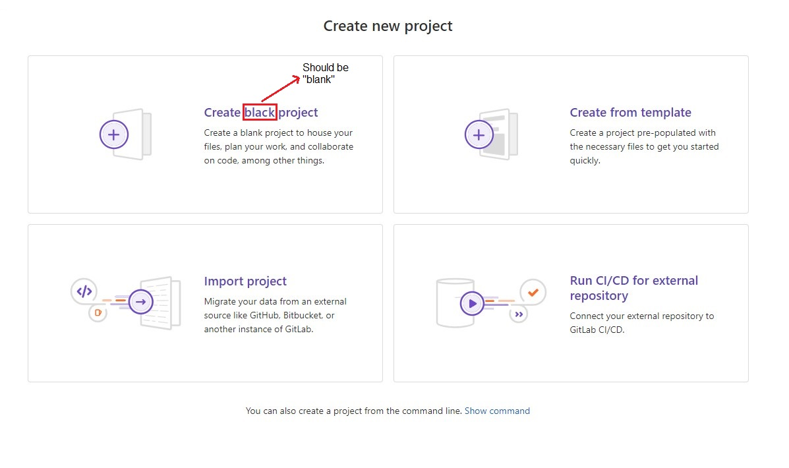
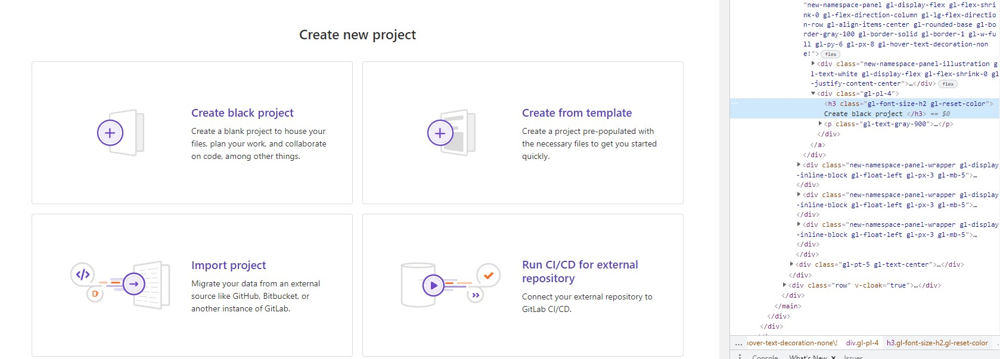

## Summary (Summarize the bug encountered concisely)

When creating a new blank project in GitLab, a typo error is found on the blank project template

## Steps to reproduce

Go to Gitlab site at https://gitlab.com/users/sign_in
Login to Gitlab using your own credentials
Select "New project"
On the project creation page, notice the "Create black project"

## Example Project

Example project created at https://gitlab.com/Michael_Laurea/project-one

## What is the current bug behavior?

On the project creation page, "Create black project" does not make sense and the word black is not applicable to the context

## What is the expected correct behavior?

The expected word should be "blank" instead of black.

## Relevant logs and/or screenshots

## Possible fixes

Checking the elements tab in the developer tools, we can see that in the html file, the typo occurs.
We can change the word from the html file in question, from black to blank

